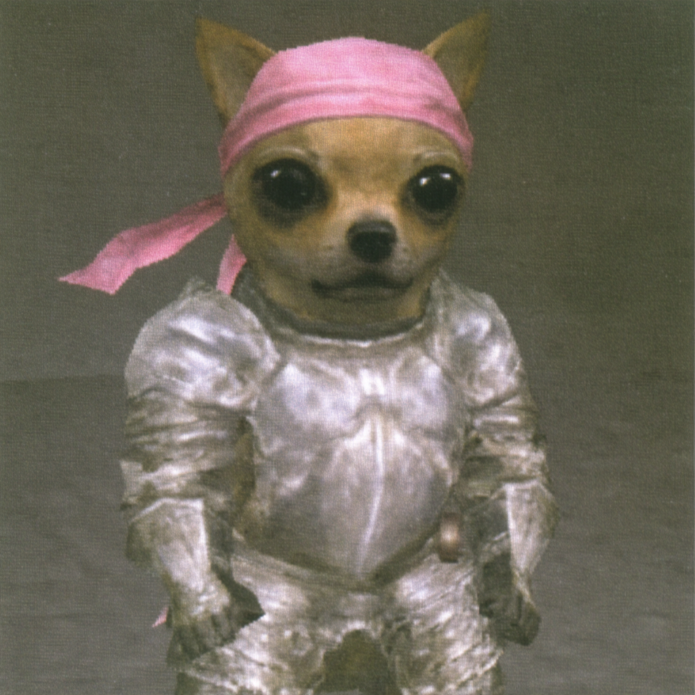
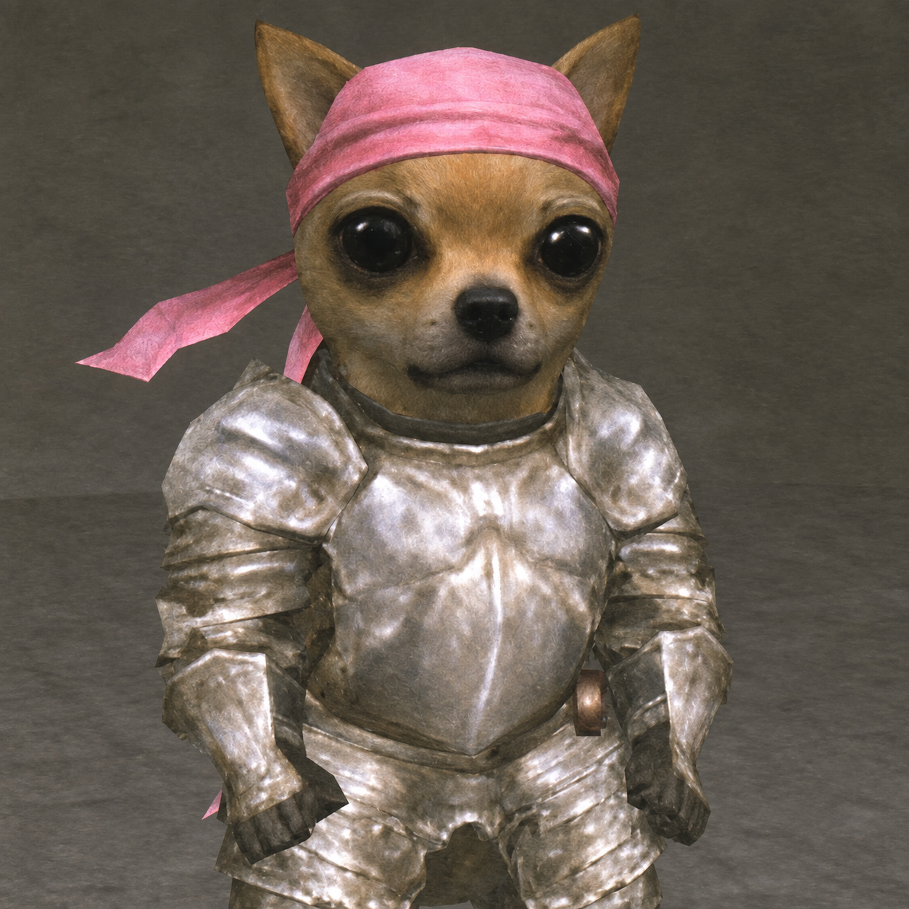

# Midjourney Frame Refiner

By [nosimaj](https://nosimaj.com).

Built around the GPT Image cleanup workflow, with support for an existing compatible image-editing connection.

A reusable agent skill for cleaning up Midjourney frames while preserving the look that made them worth keeping. Use it between your chosen genesis frame and animation or storyboard production.

## Before and after

A real example from the session that inspired this skill: a Midjourney frame of a Chihuahua in silver armor and a pink durag, refined with the image-editing workflow.

| Before · Midjourney frame | After · refined frame |
| --- | --- |
|  |  |
| 1024 × 1024 | 1254 × 1254 |

The cleanup reduces heavy grain and blur while retaining the retro game aesthetic. These are the original session files. This example demonstrates generative refinement with a modest resolution increase, not a verified 2× upscale or pixel-identical restoration.

## What it does

- Reduces distracting grain, blur, compression artifacts, and muddy detail.
- Preserves subject identity, expression, composition, lighting, and visual style.
- Supports light, balanced (default), and strong refinement.
- Protects intentional retro geometry, painted textures, anime linework, and atmosphere.
- Checks results for visual drift and verifies dimensions before reporting an upscale.

This is a skill containing instructions for an AI agent. It requires an image-editing tool or an existing provider connection. It does not include a model, API credits, or an image-processing application. Generative refinement can reconstruct details; exact pixel preservation is not guaranteed.

## Install in Big Bridge / Nosimaj Studio

Download this repository or clone it:

```sh
git clone https://github.com/nosimajtechnology/midjourney-frame-refiner.git
```

Give your coding agent the downloaded folder and this instruction:

> Install this skill into the current project. Read AGENTS.md and inspect existing skill discovery conventions first. Place SKILL.md and agents/openai.yaml in a midjourney-frame-refiner skill folder in the appropriate directory, register it only if required, and verify discovery. Use our existing image-editing provider. Make refinement an optional step after selecting a genesis frame and before storyboard or animation preparation. Preserve original assets and existing provider configuration.

The project determines the installation path. Installing this skill in ChatGPT does not automatically install it in a local checkout.

## Use

Attach a frame or provide its local path:

> Use midjourney-frame-refiner to clean up this frame. Keep the original look.

Optional variations:

> Light cleanup. Keep the grain and atmospheric softness.

> Balanced refinement. Clarify the eyes and armor without modernizing the PS2 rendering.

> Refine this frame and deliver a 2x upscale. Verify the final pixel dimensions.

Exact-size upscaling requires a compatible available tool. If no editing provider is connected, the skill produces an edit prompt and explains the missing capability.

## Files

- `SKILL.md`: workflow, preservation rules, edit prompt template, quality checks, and Big Bridge handoff.
- `agents/openai.yaml`: display metadata for compatible agent hosts.

Independent community project by Nosimaj Media; not affiliated with Midjourney.
